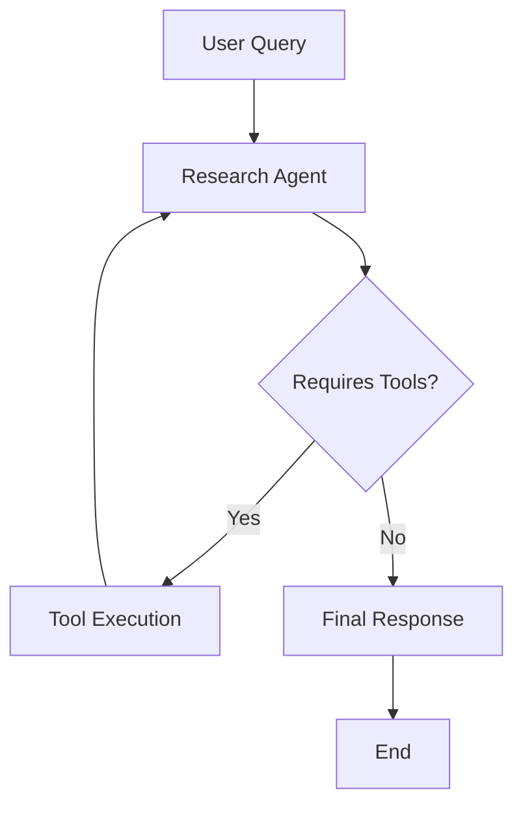

# Research AI Agent

An AI-powered academic research assistant built with LangGraph and LangChain. This system searches multiple academic databases, processes research papers, and provides intelligent research assistance.

## 🎯 Overview

The Research AI Agent is a comprehensive system that automates academic exploration across databases such as arXiv, PubMed, Semantic Scholar, and CrossRef. Beyond database search, it can intelligently search the web for relevant research on any topic, download and parse papers, and assist users in querying, summarizing, and analyzing complex research content.

It goes a step further — the agent can generate new research papers in authentic academic formatting and structure, synthesizing insights from multiple sources while maintaining coherence and originality.


## 🏗️ Architecture

### LangGraph Workflow


**Research Agent**: Single-agent system that uses various academic search tools to gather information and process PDFs.

## 🛠️ Available Tools

### Academic Search Tools (LangChain)

#### Core Database Tools
- **`arxiv_search`** - Searches arXiv for recent papers on a topic, returns metadata including title, authors, summary, and PDF links
- **`pubmed_search`** - Searches PubMed for biomedical/life sciences papers, returns metadata including title, authors, summary, and PMID links
- **`semantic_scholar_search`** - Searches Semantic Scholar (AI/CS focused), returns paper metadata including citation counts, years, and PDF URLs
- **`crossref_search`** - Searches across multiple publishers via CrossRef, returns metadata including DOI, publisher, and subject categories

#### Multi-Database Tools
- **`multi_database_search`** - Simultaneously searches all academic databases (arXiv, PubMed, Semantic Scholar, CrossRef) and returns organized results by source
- **`download_papers_from_search`** - Searches specified databases and downloads available PDFs to local directories

#### PDF Processing Tools
- **`read_pdf`** - Extracts text content from PDF files
- **`read_pdf_with_metadata`** - Extracts text and metadata from PDF files
- **`render_latex_pdf`** - Generates PDF files from LaTeX content

## 📦 Installation & Setup

### Prerequisites
- Python 3.8 or higher
- OpenAI API key
- Git

### 1. Git Initialization

```bash
# Initialize git repository (if not already done)
git init

# Add remote origin (replace with your repository URL)
git remote add origin <your-repository-url>

# Create .gitignore
cat > .gitignore << EOF
.env
__pycache__/
*.log
downloaded_papers/
research_papers/
venv/
.DS_Store
EOF

# Initial commit
git add .
git commit -m "Initial commit: Research AI Agent with multi-database search"
```

### 2. Environment Setup

```bash
# Create virtual environment
python -m venv venv
source venv/bin/activate  # On Windows: venv\Scripts\activate

# Install dependencies
pip install -r requirements.txt

# Create .env file
cat > .env << EOF
OPENAI_API_KEY=your_openai_api_key_here
EOF
```

## 🚀 Running the Application

### Option 1: Streamlit Frontend
```bash
streamlit run frontend.py
```
- Access at `http://localhost:8501`
- Interactive chat interface for research queries

### Option 2: FastAPI Backend
```bash
uvicorn api:app --host 0.0.0.0 --port 8001 --reload
```
- API documentation at `http://localhost:8001/docs`

### Option 3: Command Line Testing
```bash
python -c "
from research_tool import arxiv_search, multi_database_search

# Test single database search
result = arxiv_search.invoke({'topic': 'machine learning', 'max_results': 3})
print('arXiv papers found:', len(result))

# Test multi-database search
results = multi_database_search.invoke({
    'topic': 'attention mechanisms in transformers',
    'max_results': 5
})
for database, papers in results.items():
    print(f'{database}: {len(papers)} papers found')
"
```

## 📁 Project Structure

```
research/
├── research_tool.py              # Academic search tools (LangChain)
├── ai_researcher.py              # Main research agent with LangGraph
├── api.py                        # FastAPI backend for research
├── frontend.py                   # Streamlit frontend
├── pdf_reader.py                 # PDF text extraction
├── pdf_writer.py                 # PDF generation from LaTeX
├── requirements.txt              # Python dependencies
├── .env                          # Environment variables
├── downloaded_papers/            # Downloaded research papers
└── research_papers/              # Additional paper downloads
```

## 🔧 Configuration

### Environment Variables
```bash
OPENAI_API_KEY=your_openai_api_key_here
```

### Model Configuration
- **Research Agent**: Uses GPT-4o-mini for cost efficiency and fast responses
- **Temperature**: 0.7 for balanced creativity and accuracy
- **Max Tokens**: 4000 for comprehensive responses

## 📚 Usage Examples

### Basic Research Queries

```python
# Search academic papers across all databases
from research_tool import multi_database_search

results = multi_database_search.invoke({
    "topic": "attention mechanisms in transformers",
    "max_results": 5
})

for database, papers in results.items():
    print(f"\n{database.upper()}:")
    for paper in papers[:2]:  # Show first 2 papers
        print(f"- {paper['title']}")
        print(f"  Authors: {', '.join(paper['authors'][:3])}")
        if 'pdf' in paper and paper['pdf']:
            print(f"  PDF: {paper['pdf']}")
```

### PDF Processing

```python
# Download and read papers
from research_tool import download_papers_from_search, read_pdf

# Download papers from arXiv
download_results = download_papers_from_search.invoke({
    "topic": "neural networks",
    "source": "arxiv",
    "max_results": 3,
    "output_dir": "research_papers"
})

print(f"Downloaded {download_results['total_downloaded']} papers")

# Read a downloaded PDF
if download_results['successful_downloads']:
    pdf_path = download_results['successful_downloads'][0]['filepath']
    content = read_pdf.run(pdf_path)
    print(f"Extracted {len(content)} characters from PDF")
```

### Interactive Chat Session

```python
# Start a research session
from ai_researcher import start_new_research_session

config = start_new_research_session(topic="machine learning")
print(f"Started session with thread_id: {config['configurable']['thread_id']}")

# Ask research questions
from langchain_core.messages import HumanMessage

messages = [HumanMessage(content="Find recent papers about transformer attention mechanisms")]
response = graph.invoke({"messages": messages}, config)
print(response["messages"][-1].content)
```

## 🔍 API Endpoints

### Research API (Port 8001)
- `GET /` - Health check
- `POST /api/research` - Start new research session
- `POST /api/chat/{session_id}` - Send message in research session
- `GET /api/sessions` - List all research sessions

## 🧪 Testing & Development

### Running Tests
```bash
# Test research tools interactively
python research_tool.py

# Test specific tools
python -c "
from research_tool import arxiv_search, pubmed_search, semantic_scholar_search, crossref_search

# Test all search tools
tools = [arxiv_search, pubmed_search, semantic_scholar_search, crossref_search]
for tool in tools:
    try:
        result = tool.invoke({'topic': 'artificial intelligence', 'max_results': 1})
        print(f'✓ {tool.name}: {len(result)} results')
    except Exception as e:
        print(f'✗ {tool.name}: {e}')
"
```

### Logging
- Research logs: `research_search_*.log`
- Check logs for detailed execution traces and API interactions

## 🤝 Contributing

1. Fork the repository
2. Create a feature branch: `git checkout -b feature/research-feature`
3. Make your changes and test thoroughly
4. Commit: `git commit -m 'Add research feature'`
5. Push: `git push origin feature/research-feature`
6. Open a Pull Request

## 📋 Development Guidelines

### Code Style
- Follow PEP 8 for Python code
- Use type hints for function parameters
- Include docstrings for all functions and classes
- Use meaningful variable and function names

### Adding New Research Sources
1. Create a new search function following the existing pattern
2. Add appropriate error handling and logging
3. Include the new tool in the main tools list
4. Update documentation and examples

## 🔒 Security & Best Practices

- Never commit API keys to version control
- Use environment variables for sensitive configuration
- Validate user inputs and handle errors gracefully
- Follow security best practices for file operations
- Use secure random session IDs for API endpoints

## 🆘 Troubleshooting

### Common Issues

1. **Import Errors**: Ensure all dependencies are installed with `pip install -r requirements.txt`
2. **API Key Issues**: Verify `.env` file contains valid OpenAI API key
3. **Port Conflicts**: Check if port 8001 is available
4. **Memory Issues**: Large PDF processing may require more RAM

### Debug Mode
Enable debug logging:
```bash
export PYTHONPATH=$PWD
python -c "import logging; logging.basicConfig(level=logging.DEBUG)"
```

## 🎯 Future Enhancements

- [ ] Add more academic databases (Google Scholar, IEEE, ACM)
- [ ] Implement user authentication and project management
- [ ] Add support for more file formats (DOCX, presentations)
- [ ] Create web-based admin dashboard
- [ ] Add collaborative features for team research
- [ ] Implement caching for improved performance

## 📞 Support

For issues, questions, or contributions:
1. Check the execution logs for detailed error information
2. Open an issue on the repository
3. Review the troubleshooting section above

---

*Built with ❤️ using LangGraph, LangChain, and OpenAI GPT models.*
